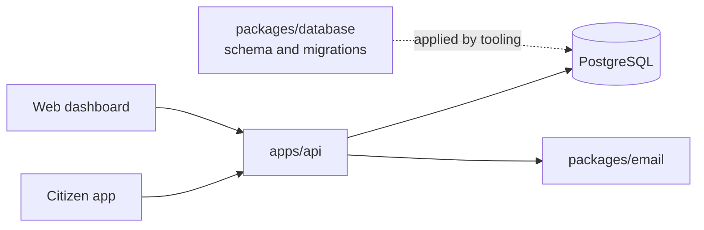
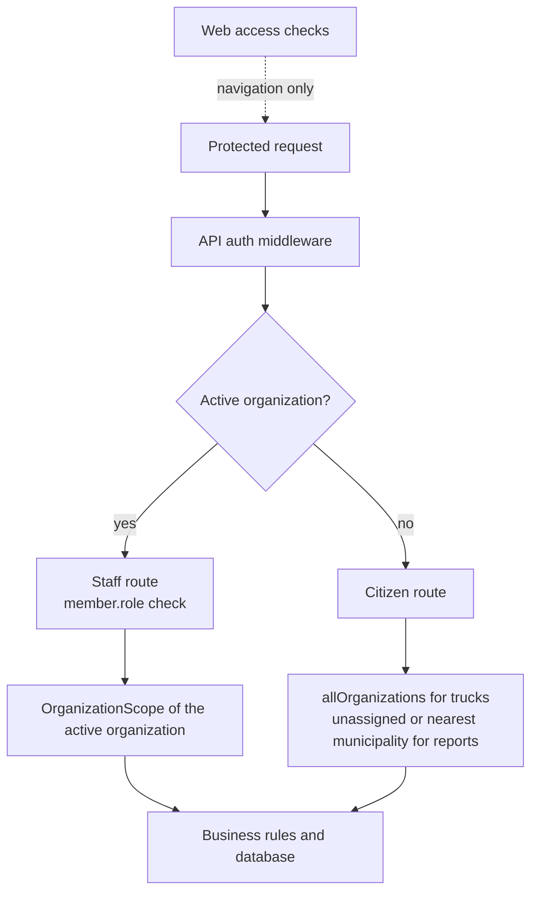

# Architecture

Lima Limpia has one data owner: `apps/api`. The clients render screens and send
HTTP requests. They do not write to PostgreSQL.

## Runtime flow



- `apps/api` runs the Hono application and owns authentication, authorization,
  validation, business rules, and persistence.
- `apps/web` is a Next.js dashboard. Its server actions call the API and pass
  the session cookie through to it.
- `apps/citizen` is an Expo client. It calls the API from the device and stores
  the local session hint in Expo Secure Store.
- `packages/database` defines the schema and migration files. The API currently
  creates its own `pg` pool and runs parameterized SQL.
- `packages/email` renders the password reset email.

`apps/server` is a standalone `json-server` prototype. It is not connected to
the API or the production database.

## API structure

The API uses a small layered structure under `apps/api/src/internal`:

```text
domains/<name>/
  handler.ts       HTTP routes and request parsing
  service.ts       business rules and failure decisions
  repository.ts    database access
  queries.ts       parameterized SQL
  schemas.ts       Zod request schemas
  models.ts        TypeScript types
```

Not every domain has every file. `admin`, `auth`, `citizen`, `driver`, and
`health` expose handlers. `trucks`, `routes`, `assignments`, `issues`, and
`locations` provide data used by those handlers.

The container in `internal/container/container.ts` is the composition root. It
creates the database, repositories, services, middleware, and handlers. Register
new dependencies there.

Repositories run parameterized SQL through `pg`. Drizzle is used for schema
definition and migrations, not for API query building. Use
`Database.withTransaction` when related writes must succeed or fail together.

## Authentication and roles

Better Auth manages email/password sessions and organization membership. Clients
send the session cookie with protected requests.

There are two role concepts:

- `user.role` is Better Auth's global role, stored on the `user` table. It is
  not the source of staff access checks.
- `member.role` is the role in the active organization, stored on the `member`
  table (one row per user per organization). Staff routes, and the web
  dashboard's own access checks, read this value. The current roles are `owner`,
  `admin`, `supervisor`, and `driver`.

### Tenancy

One organization is one municipality. Several run on one deployment, each
isolated from the others. Every fact that decides who sees what has one place
and one actor that may change it:

| Fact                                     | Stored in                      | Changed by                                                                                                                                                                                                    |
| ---------------------------------------- | ------------------------------ | ------------------------------------------------------------------------------------------------------------------------------------------------------------------------------------------------------------- |
| A municipality                           | `organization` row             | The operator, with `setup:municipality`. Nothing over HTTP creates one.                                                                                                                                       |
| A staff member's role in a municipality  | `member.role`                  | An owner or admin of that municipality, or a supervisor for drivers, through `POST /api/admin/users` and `canManageRole`. The first owner is written by `setup:municipality`. No route changes it afterwards. |
| The global role                          | `user.role`                    | The same writers as `member.role`, written together with it. Not read for staff checks. A self-registered citizen gets `citizen`.                                                                             |
| The municipality a session works in      | `session.activeOrganizationId` | The user, through `organization/set-active`, and only among their own memberships.                                                                                                                            |
| The municipality a domain row belongs to | `organization_id` on the row   | The API, from the caller's scope. No request body carries it.                                                                                                                                                 |

Ten domain tables carry a required `organization_id`: `truck`, `route`,
`route_waypoint`, `route_schedule`, `route_assignment`, `driver_issue_report`,
`system_alert`, `dispatch_message`, `truck_current_location` and
`truck_location_history`. Where a row references another tenant row (an
assignment's route, truck, and driver; a location's or an alert's assignment; an
alert's truck), the foreign key includes `organization_id`, so the database
rejects a row that mixes two municipalities. A composite `SET NULL` would also
null `organization_id`, so an assignment or truck that an alert or a current
location references cannot be deleted; the API deactivates trucks instead.
`citizen_issue_report.organization_id` is nullable: `NULL` means no municipality
is in reach of the report.

Citizens are global. A citizen has no membership, keeps one account when they
move, and sees the active trucks and live locations of every municipality
through the citizen routes, which take an `allOrganizations` scope. A citizen
report goes to the municipality of the nearest active route (its start or any
waypoint) within 5 km of the report's coordinates; with none in reach it stays
unassigned, and only its author lists it.

Scoping is a type, not a habit. Staff middleware checks the active-organization
membership and puts an `OrganizationScope` on the request. Every repository
method of a tenant table takes a scope as its first argument, and repositories
extend `TenantRepository` (`apps/api/src/internal/shared/tenancy`), which has no
raw query method. A query is built with `tenantQuery`, which refuses SQL that
has no `{{scope:alias}}` or `{{organization_id}}` marker, and the marker is
replaced with `alias.organization_id = $n` at execution. A read may run under
`allOrganizations`; a write accepts only an organization or the unassigned
scope, so no statement can write into every municipality. A lint rule
(`biome-plugins/no-service-database-access.grit`) rejects `db.query` in services
and handlers, so SQL cannot bypass the repositories. A row outside the caller's
scope reads as missing: 404 for a single resource, an empty list for a
collection.

A role name alone never grants access to another municipality's data: owning any
organization authorizes only that organization.

No platform role exists, and the admin plugin's role set grants nothing, so no
staff account reads more than one municipality. The only cross-municipality read
is the citizens' view of active trucks.

Migration `0007_organization_tenancy` assigns existing rows to the only
organization. It aborts, and changes nothing, when rows exist and the database
holds anything other than exactly one organization, because it cannot guess
which municipality owns them. An empty database applies with any number.

Better Auth's `organization` and `admin` plugins mount their own endpoints under
`/api/auth/*`, each with its own permission check independent of this app's
`/api/admin/*` routes and `canManageRole`. Both plugins share this app's
access-control statements (`packages/database/src/auth/roles.ts`), which also
back `requirePermission` for the app's own admin routes — so a statement added
for route-level gating (e.g. `user: ['create']`, needed so a supervisor can call
`POST /api/admin/users`) also, unless guarded, authorizes the plugin's own raw
HTTP endpoint for the same resource, with no equivalent to `canManageRole`'s
hierarchy. Worse, Better Auth grants an organization's creator (`owner`, the
plugin's `creatorRole` default) every permission on member-role endpoints
regardless of `roles`/`ac` at all (`allowCreatorAllPermissions`, on by default
in the `organization` plugin's `update-member-role`): an owner could call it and
promote any member, including to owner, no matter how `roles` was configured.
Access-control statements cannot close that off, so closing each dangerous
endpoint's `ac` grant one at a time is a dead end.

`apps/api/src/internal/domains/auth/handler.ts` instead mounts only the
`/api/auth/*` paths this app's own clients (`apps/web`, `apps/citizen`) call:
`get-session`, `sign-in/email`, `sign-up/email`, `sign-out`,
`request-password-reset`, `reset-password`, the `GET reset-password/:token` link
Better Auth's own password-reset email sends,
`organization/get-active-member-role`, `organization/list`, and
`organization/set-active`. Every other endpoint either plugin registers —
`organization/create`, `update-member-role`, `invite-member`,
`accept-invitation`, `get-full-organization`, and the `admin` plugin's own
`set-role`, `create-user`, `ban-user`, `impersonate-user`, `remove-user`, and
`set-user-password` — returns 404 before Better Auth's handler ever runs, so no
caller can reach them with their own session regardless of role or plugin
permission configuration.

This allowlist is exactly the set of `{method, path}` pairs `apps/web` and
`apps/citizen` call today, not a broader guess at what Better Auth documents. A
new call site means adding its route to `ALLOWED_ROUTES` in `handler.ts` and a
passing test in `apps/api/tests/authorization.test.ts` asserting it is mounted —
not widening the allowlist ahead of an actual caller.

Two plugin options are also still set, as defense in depth in case the allowlist
above is ever loosened or a future feature calls one of these endpoints
programmatically with a real user session (today nothing does; the one caller
that legitimately creates organizations and members,
`AdminService.createOrganizationUser`, does so through different, server-only
APIs — see below):

- `allowUserToCreateOrganization: false` on the `organization` plugin, so even a
  reachable `organization/create` could not let an authenticated user create a
  municipality. Only the operator does, with `setup:municipality`.
- A separate, empty role set (`disabledAdminPluginRoles` in `roles.ts`) passed
  to the `admin` plugin only, so none of its endpoints authorize for any role.
  `appPluginRoles` is unchanged and still backs `requirePermission` and the
  `organization` plugin.

`AdminService.createOrganizationUser` (called from `createUser` and
`createDriver` in `apps/api/src/internal/domains/admin/service.ts`, through the
shared `createStaffUser`/`ensureStaffUser` in `@lima-garbage/database`) is the
only _request_-reachable writer of `member.role`, and the only request-reachable
writer of `user.role` to anything other than the default. `user.role` comes from
Better Auth's own `createUser` (the `admin` plugin), called directly
(`this.authService.api.createUser`, not `fetch`), bypassing the HTTP handler
(and its allowlist) entirely, with no session headers, so it runs as Better
Auth's own "system action"; the endpoint does have an HTTP path
(`/api/auth/admin/create-user`), closed above by the handler's allowlist, so no
caller can reach it with their own session. `member.role` is then written
directly — a parameterized `INSERT INTO member` (`insertMember` in
`packages/database/src/auth/create-staff-user.ts`), not Better Auth's
`addMember` — because `ensureStaffUser`'s repair path must write a repaired
`member.role` and a repaired `user.role` together or not at all, and `addMember`
runs on Better Auth's own connection, which cannot join a transaction this
package holds open on the shared `pg.Pool` (`withTransaction` in
`packages/database/src/auth/transaction.ts`). A unique constraint on
`member (userId, organizationId)` keeps that insert from creating a second
membership for the same user in the same organization, and an index on
`member (organizationId)` keeps lookups by organization indexed. A failed member
write still deletes the user Better Auth just created, so `createStaffUser`
never leaves one behind without a membership. `canManageRole` in
`packages/database/src/auth/roles.ts` limits which role an actor may assign this
way: an owner or admin may create an admin, supervisor, or driver; a supervisor
may only create a driver. `updateUser` cannot change either role —
`UpdateUserSchema` has no `role` field, and the service only rewrites name,
email, and password. It still calls `canManageRole`, but there against the
target's existing role, to gate who may edit that account, not to authorize a
role change.

The public `POST /api/auth/sign-up/email` endpoint also writes `user.role`, to
the `admin` plugin's `defaultRole` (`'citizen'`, set in
`apps/api/src/internal/domains/auth/service.ts`): the plugin registers a
`databaseHooks.user.create.before` hook that runs for every user creation,
including this one, and sets `role: defaultRole` unless the caller already
supplied one. A self-registered citizen never has an active organization, so
this write does not interact with `member.role` or staff access at all — it only
affects what `user.role` (not read for staff checks) holds for that account.

`packages/database/scripts/create-municipality.ts` (`setup:municipality`) is the
one other writer of `member.role`. It creates a municipality and its first
owner, and the operator runs it once per municipality. It uses the same shared
`createAppAuth` instance as the API and the seed script
(`packages/database/src/auth/create-auth.ts`), calling `createUser` for the
owner's `user.role = 'owner'`, then writing the organization and its owner
membership itself — a parameterized `INSERT INTO organization` followed by
`insertMember` with `role: 'owner'`, in one `withTransaction` on the shared pool
— instead of Better Auth's `createOrganization`, for the same reason
`createOrganizationUser` above does not use `addMember`: the organization row
and its owner membership must land together or not at all, and Better Auth's own
connection cannot join that transaction. This is the bootstrap write of
`member.role = 'owner'` for the organization's first member — every later
`member.role` write for a real member goes through `createOrganizationUser`
above. `setup:municipality` is a local script invoked directly
(`bun run scripts/create-municipality.ts`), not reachable over HTTP, so it does
not reintroduce the escalation above.

`packages/database/scripts/seed.ts` (`db:seed`) is a third writer, but a
dev-only one: it calls `ensureStaffUser`, the same shared step
`create-municipality.ts` uses for `insertMember`, to add its fixture staff users
to the oldest municipality and gives that municipality its fixture trucks,
route, and assignment. It is a local script, not reachable over HTTP, and its
fixture data (see `readme.md`) is not meant for production use.

Citizens are authenticated users without an active organization. The citizen
middleware rejects a session that has an active organization. Staff middleware
requires an active organization, a membership in it, and an allowed member role.

The web app checks access in its middleware and server actions by fetching
`/api/auth/organization/get-active-member-role` for the current session cookie,
never by reading `user.role` from the session. The API checks it again from the
same membership table. The client check improves navigation; the API check is
the security boundary.

That lookup can fail independently of whether the user has a role (a 5xx, a
connection error) and must not be read as "no role": the web app's own checks
(`apps/web/src/proxy.ts`, `apps/web/src/features/auth/lib.ts`,
`apps/web/src/features/auth/actions.ts`) fail the request instead, without
signing the user out.



## Database ownership

Only `apps/api` may import `@lima-garbage/database`. Change the schema in
`packages/database/src/schema`, generate a migration, review the SQL, and apply
it to the intended database. Keep each migration SQL file with the matching
entry in `migrations/meta/_journal.json`.

The database package contains tables for authentication, organizations, routes,
assignments, trucks, locations, issues, messages, push tokens, and citizen
profiles.

## Data freshness

The citizen app polls truck data only while it is active. The API treats a truck
location as usable for citizen status only while it belongs to an active
assignment and was updated within the last ten minutes.

The web API client uses live responses by default. It opts into a short cache
only for list views that change less often.
