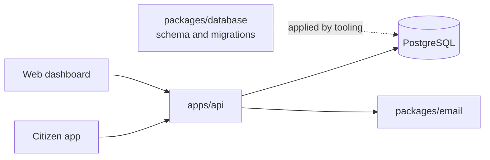
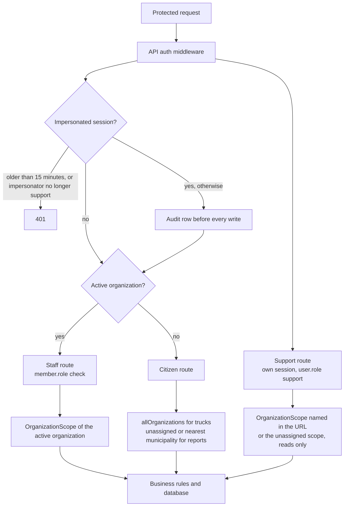

# Architecture

Lima Limpia has one data owner: `apps/api`. The clients render screens and send
HTTP requests. They do not write to PostgreSQL.

## Runtime flow



| Path                | Responsibility                                                                                                                          |
| ------------------- | --------------------------------------------------------------------------------------------------------------------------------------- |
| `apps/api`          | The Hono application: authentication, authorization, validation, business rules, and persistence.                                       |
| `apps/web`          | Next.js dashboard. Server components and server actions call the API and pass the session cookie through. `src/proxy.ts` guards routes. |
| `apps/citizen`      | Expo client. It calls the API from the device and keeps the session in Expo Secure Store.                                               |
| `apps/server`       | `json-server` mock that serves `db.json` on port 8000.                                                                                  |
| `packages/database` | Drizzle schema, migrations, the shared Better Auth setup, and the `setup:*` and `db:seed` scripts.                                      |
| `packages/email`    | React Email templates and the `renderPasswordReset` renderer the API calls.                                                             |
| `datasets`          | Marimo notebooks. They share no code with the rest.                                                                                     |

Only `apps/api` imports `@lima-garbage/database`. The web and citizen apps reach
data through the API.

## API structure

Code lives under [`apps/api/src/internal`](apps/api/src/internal):

```text
cmd/server.ts            entry point
container/container.ts   composition root
domains/<name>/
  handler.ts             HTTP routes and request parsing
  service.ts             business rules and failure decisions
  repository.ts          database access
  queries.ts             parameterized SQL
  schemas.ts             Zod request schemas
  models.ts              TypeScript types
shared/
  config/                environment loading
  database/              the pg pool and transactions
  middleware/            authentication, permission, and CORS middleware
  tenancy/               scopes and scoped queries
  utils/                 errors, response helpers, validation
```

A domain has only the files it needs. `admin`, `auth`, `citizen`, `driver`,
`health`, and `support` expose handlers, and [`app.ts`](apps/api/src/app.ts)
mounts them under `/api`. `trucks`, `routes`, `assignments`, `issues`,
`locations`, and `users` provide repositories and models that those handlers
use.

[`container.ts`](apps/api/src/internal/container/container.ts) creates the
database, repositories, services, middleware, and handlers. Register each new
dependency there.

Repositories run parameterized SQL through `pg`. Drizzle defines the schema and
migrations and builds no API queries. `Database.withTransaction` runs related
writes together.

Services throw `AppError` subclasses from
[`errors.ts`](apps/api/src/internal/shared/utils/errors.ts). `app.ts` turns them
into `{ "error": "..." }` responses.

## A protected request



The pieces are described in [Authentication](docs/authentication.md),
[Tenancy](docs/tenancy.md), and [Support access](docs/support.md).

## Database

Change the schema in
[`packages/database/src/schema`](packages/database/src/schema), generate a
migration, review the SQL, and apply it to the intended database. Each migration
SQL file has a matching entry in
[`migrations/meta/_journal.json`](packages/database/migrations/meta/_journal.json).
The [database readme](packages/database/readme.md) covers the commands.

The schema holds tables for authentication, organizations, routes, assignments,
trucks, locations, issues, messages, push tokens, citizen profiles, and the
support audit log.
