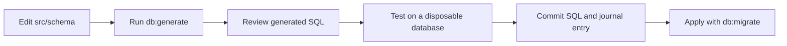

# Database package

`@lima-garbage/database` owns the PostgreSQL schema used by the API. It defines
tables with [Drizzle](https://orm.drizzle.team/docs/overview) and stores
generated migrations. The API creates its own `pg` pool and runs parameterized
SQL. The API does not use Drizzle to build queries.

The API is the only workspace that imports this package. The web and citizen
apps call the API instead of connecting to PostgreSQL. The package also holds
the Better Auth setup that the API and the scripts share
([`src/auth`](src/auth)).

## Schema

Schema files live in [`src/schema`](src/schema):

- `auth.ts`: users, sessions, organizations, members, and invitations.
- `citizens.ts`: citizen profiles and education progress.
- `communications.ts`: dispatch messages and push notification tokens.
- `issues.ts`: citizen reports, driver reports, and system alerts.
- `locations.ts`: current truck locations and location history.
- `routes.ts`: routes, waypoints, schedules, and assignments.
- `support.ts`: the support audit log.
- `trucks.ts`: truck records.

[`src/schema/index.ts`](src/schema/index.ts) exports the tables and defines all
Drizzle relations.

## Environment

The schema tools need `DATABASE_URL`. The setup and seed scripts also need
`BETTER_AUTH_SECRET`. `BETTER_AUTH_URL` is optional and defaults to
`http://localhost:4000`.

Copy [`../../.env.example`](../../.env.example) to `.env` and fill in the values
before running a command.

## Commands

Run these from the repository root:

```sh
bun --filter @lima-garbage/database db:generate
bun --filter @lima-garbage/database db:push
bun --filter @lima-garbage/database db:studio
```

Create a municipality and its first owner with the interactive setup script. Run
it once per municipality; it is the only way to create one:

```sh
bun --filter @lima-garbage/database setup:municipality
```

Create an account for the platform support team with the interactive support
script. The account is dedicated, so the script refuses an email that already
has one. The role can only be granted and revoked here:

```sh
bun --filter @lima-garbage/database setup:support
bun --filter @lima-garbage/database setup:support --revoke support@example.com
```

The seed script fills the oldest municipality with sample users, trucks, a
route, and assignments, so run `setup:municipality` first. Running it again
reuses the records it created.

```sh
bun --filter @lima-garbage/database db:seed
```

The seed data is for development databases only.

## Testing

```sh
bun --filter @lima-garbage/database test
```

[`testing/preload.ts`](testing/preload.ts), which [`bunfig.toml`](bunfig.toml)
preloads, starts the test database, so a bare `bun test` here is safe too. The
setup and seed script tests share that database and truncate its tables in
`beforeEach`, so they run one at a time, not with `bun test --parallel`. Each
migration test builds its own database from the earlier migration files.
`@lima-garbage/database/testing` exports
[`testing/database.ts`](testing/database.ts) to the API's test runner.
[Setup](../../docs/setup.md#run-the-tests) says where the database comes from.

## Migrations

Schema changes follow this path:



Keep each migration SQL file with its matching entry in
[`migrations/meta/_journal.json`](migrations/meta/_journal.json). The complete
history must apply to a fresh database.

`db:push` changes a database without recording a migration and is for local
development. `db:migrate` applies the committed migration files. The test
database applies the same files.
